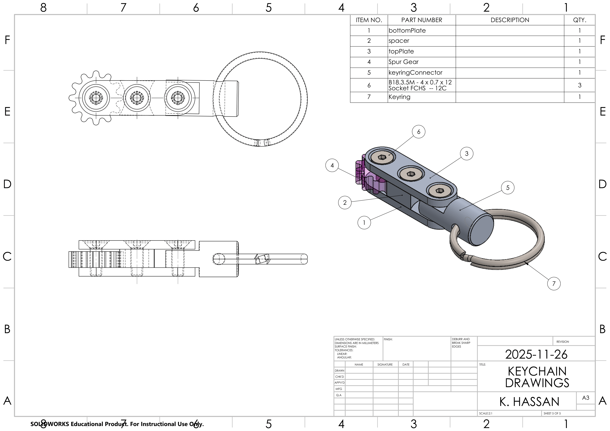
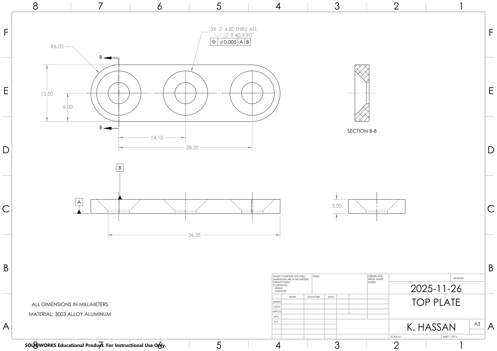
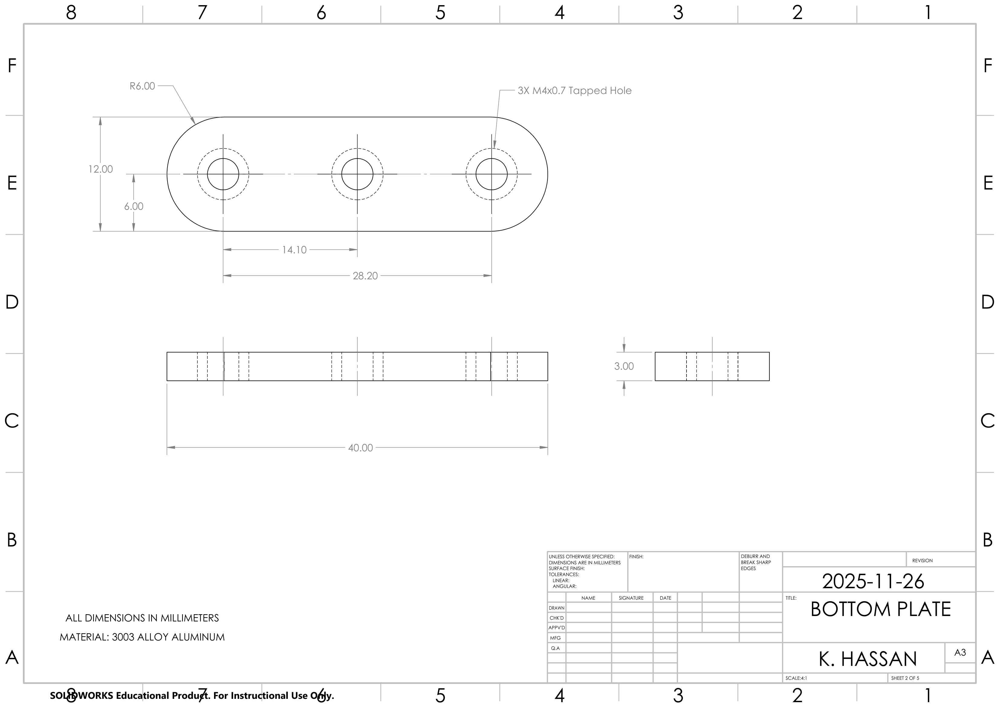
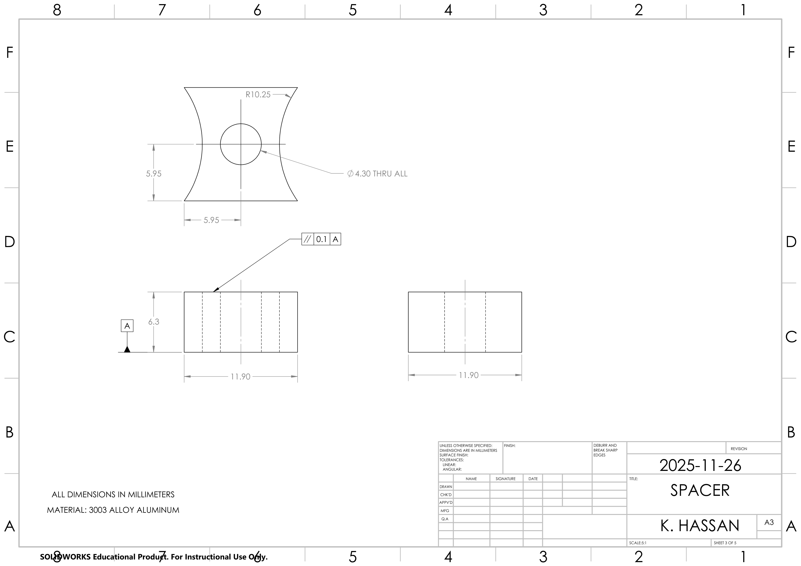
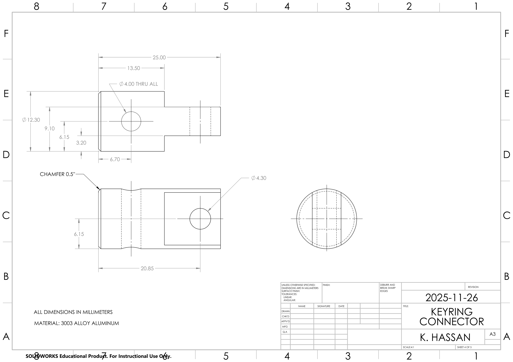

# 🔧 Machined Mechanical Keychain

A **5-part mechanical keychain** designed in **SolidWorks** and manufactured from **3003 aluminum** using conventional machining processes.

This project involved the complete mechanical design and manufacturing workflow — from **parametric CAD modeling and engineering drawings to machining, inspection, and final assembly**.

## 📸 Final Product

The completed keychain after machining and assembly:

  

## 🛠️ Skills & Tools

- **SolidWorks** – Parametric part and assembly modeling
- **GD&T** – Datums, position, and parallelism controls
- **Engineering Drawings** – Dimensioning, section views, BOMs, and manufacturing documentation
- **Machining** – Lathe, mill, drill press, and tap-and-die operations
- **Tolerance Analysis**
- **Design for Manufacturability (DFM)**
- **Mechanical Assembly & Inspection**

## ⚙️ Project Overview

The objective of this project was to design and manufacture a compact mechanical keychain consisting of multiple interacting components.

Each custom component was modeled individually in **SolidWorks**, assembled digitally to verify fit and geometry, documented through manufacturing drawings, and then physically machined and assembled.

The final assembly consists of:

- Bottom plate
- Top plate
- Spacer
- Spur gear
- Keyring connector
- Socket-head fasteners
- Keyring

## 🧩 CAD Assembly

The completed SolidWorks assembly integrates the individually modeled components into the final keychain design.

The assembly drawing includes:

- Orthographic views
- Isometric assembly view
- Component callouts
- Bill of materials (BOM)
- Fastener specifications

## 📐 Engineering Drawings

Manufacturing drawings were produced for each custom component with the dimensions and tolerances required for machining and assembly.

### Top Plate

The top plate forms the upper structural member of the keychain and contains three countersunk mounting holes for the assembly fasteners.

The drawing includes dimensional requirements, a section view, datum references, and GD&T position control.

---

### Bottom Plate

The bottom plate forms the lower structural member of the assembly.

Three **M4 × 0.7 tapped holes** allow the socket-head fasteners to secure the top plate, spacers, and remaining components together.

---

### Spacer

The spacer maintains separation between the top and bottom plates while controlling the geometry of the assembled keychain.

The drawing includes dimensional requirements and a **parallelism tolerance referenced to datum A**.

---

### Keyring Connector

The keyring connector provides the mechanical interface between the machined body of the keychain and the external keyring.

Its geometry was designed to integrate with the plate assembly while providing an attachment point for the ring.

## 🏭 Manufacturing

After completing the CAD models and engineering drawings, the components were manufactured using conventional machining equipment.

Manufacturing operations included:

- **Lathe turning**
- **Milling**
- **Drilling**
- **Tapping and threading**
- **Deburring and finishing**
- **Dimensional inspection**
- **Mechanical assembly**

Manufactured dimensions were checked against the engineering drawings to verify fit and identify areas where the design or manufacturing process could be refined.

## 📏 GD&T & Tolerancing

The drawing package incorporates engineering dimensioning and tolerancing practices to communicate manufacturing requirements.

Examples include:

- Datum identification
- Position tolerances
- Parallelism controls
- Hole and thread specifications
- Countersink specifications
- Linear and radial dimensions
- Section views

These controls were used to ensure that individually manufactured components could be assembled while maintaining the intended geometry.

## 🔄 Engineering Workflow

The project followed a complete mechanical product-development workflow:

**Concept → CAD Modeling → Assembly → Engineering Drawings → Machining → Inspection → Final Assembly**

This provided hands-on experience translating a digital CAD design into a functional manufactured product.

## 🎯 Key Takeaways

Through this project, I developed practical experience in:

- Designing parts for real-world manufacturing
- Creating parametric SolidWorks models
- Building multi-component mechanical assemblies
- Producing manufacturing-ready engineering drawings
- Applying GD&T and tolerancing principles
- Operating manual machining equipment
- Translating CAD dimensions into machining operations
- Inspecting manufactured components against drawings
- Identifying and correcting fit and manufacturing issues
